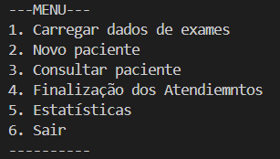

# Sistema de Gerenciamento de Exames Laboratoriais

## Descrição

- Este projeto consiste em um sistema simples desenvolvido em Java para gerenciamento de exames laboratoriais de pacientes.
- O sitema utiliza **listas lineares genéricas** de objetos, conceitos de orientação a objetos e leitura e gravação de arquivos texto (.TXT).

## Funcionalidades
- Carregamento de exames a partir de arquivo (exames.txt)
- Cadastro de pacientes com múltiplos exames
- Consulta de pacientes pelo CPF
- Geração de arquivo com os atendimentos diários
- Estatísticas:

  -> Frequência de exames

  -> Média de exames por paciente

## Conceitos aplicados
- Encapsulamento
- Classes e objetos
- Polimorfismo de sobrescrita (equals e toString)
- Generics (ListaLinear<T>)
- Manipulação de datas (LocalDate)
- Leitura e escrita em arquivos

## Objetivo acadêmico
- Projeto desenvolvido na diciplina de Estrutura de Dados com foco em praticar : manipulação de arquivos, organização de código em Java e a lógica de programação aplicada a um problema real.

## Autores
- Laura Rocha Yaguiu
- Stephanie Soares Dias